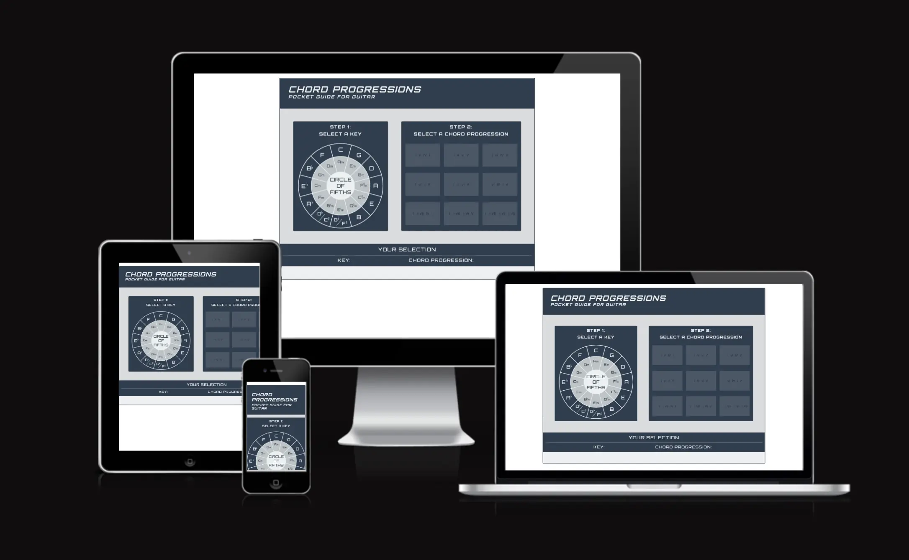
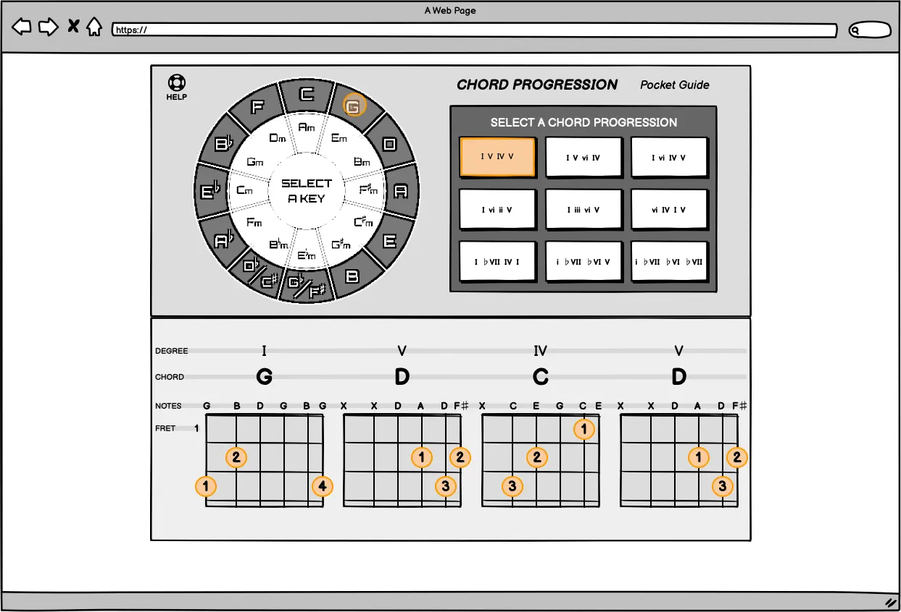
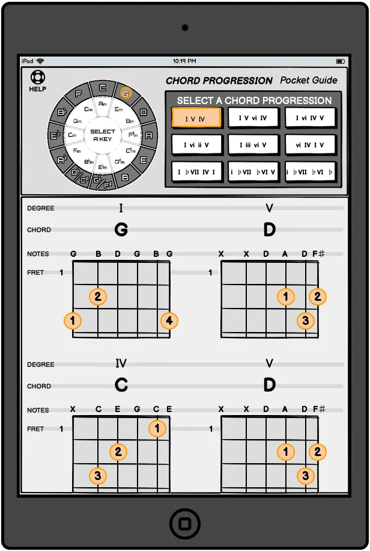
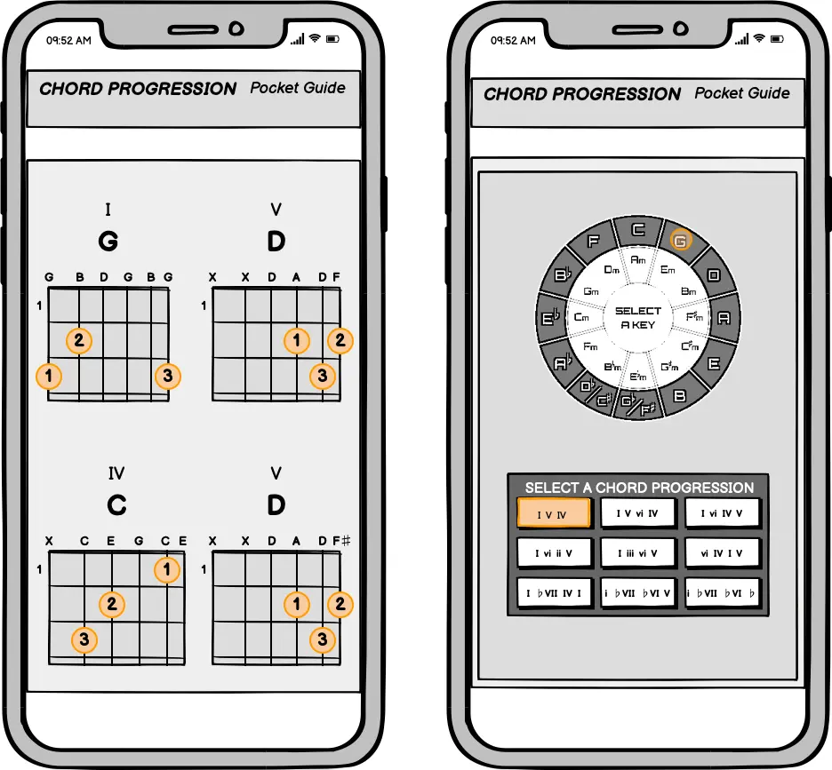
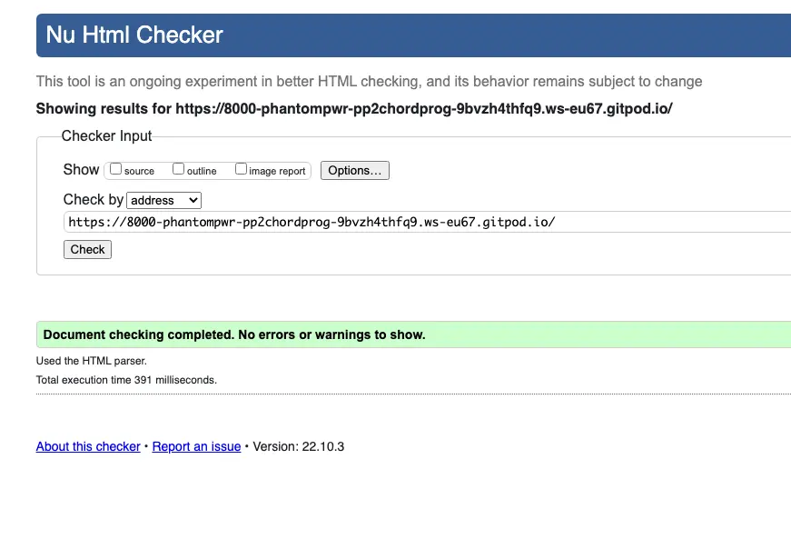
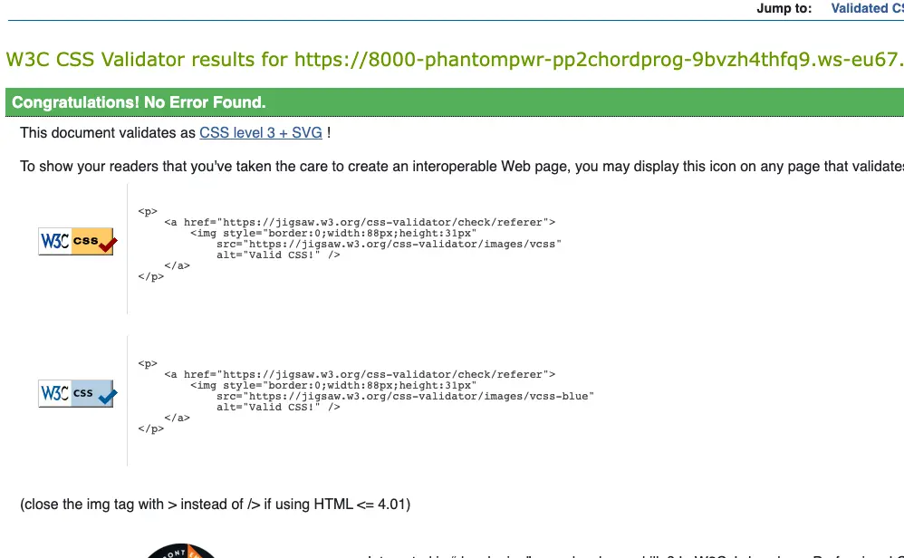
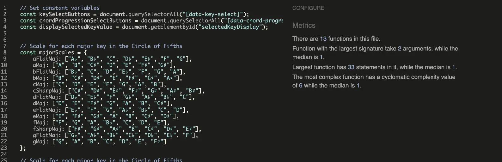
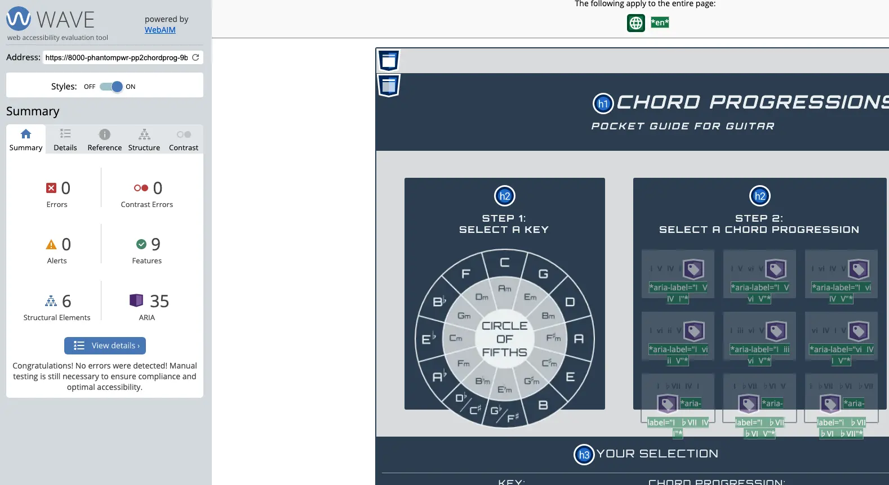
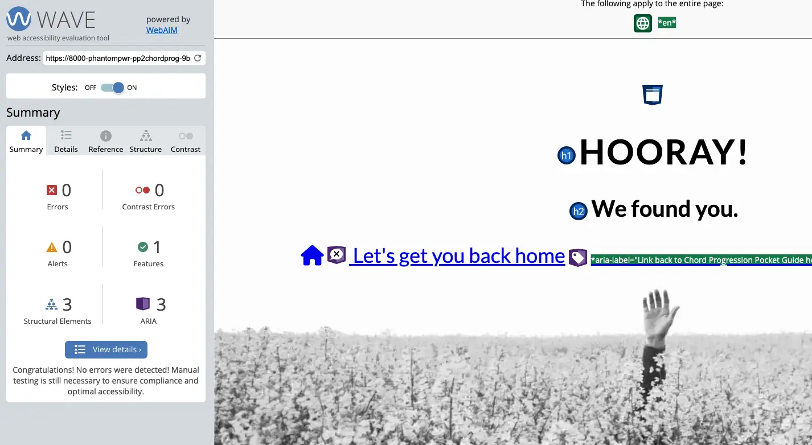
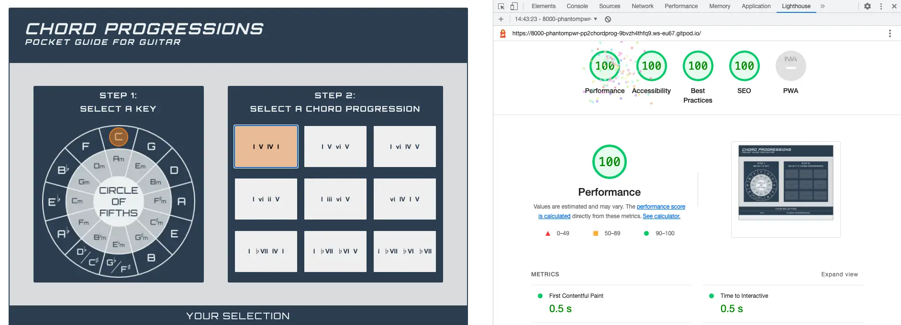

# Chord Progressions - Pocket Guide For Guitar

## Diploma in Full Stack Software Development - Portfolio Project 2

[The live project can be viewed here.](https://phantompwr.github.io/pp2-chord-progression-pocket-guide/) 

The website allows the user to choose keys and chord progressions, in order to determine which chords to play.

The user select a key, and then a chord progression. The application will then load the relevant chord diagrams.

As an example:

1. Select the key of C Major
2. Select the chord progression I V IV I
3. Diagrams for the chords Cmaj, Gmaj, Fmaj and Cmaj are displayed
4. Any combination of keys and chord progressions can be selected, which allows the user to play the same progression in different keys and vice versa

The goals of the website are:
* To generate traffic, which in turn will generate AdSense revenue.

The user visits this website to have a songwriting and practicing aid, without the need for pen and paper.

# UX
The design of the site is intentionally simple and to the point. In future, the aim is to add sound samples, so the user can hear what any selected combination will sound like.

### Ideal clients 
The ideal clients for this business are: 
* Guitarists
* Songwriters
* Music hobbyists

### User stories: 
1.	As a visitor, I am in the process of writing a song. Using pen and paper to work out which chords to play in a particular chord progression and key, quickly becomes tedious when I want to try out my idea in a different key.
2.	As a visitor, I want to practice chords in different keys, but struggle to keep track of where I am when having to page back and forth in a chord book.

### Scope
To help the visitor, the site includes: 
* All 24 keys in the Circle of Fifths
* 9 of the most popular chord progressions used in popular music
* Scale degree, chord name and fingering for each chord in the chosen chord progression

## Skeleton 
The website consists of a single page containing all the required elements in the interface.

### Original Wireframe Concepts: 
* 
* 
* 

# Features 

## Existing Features 
1. Select any key in the Circle of Fifths
2. Select any of the nine chord progressions

## Features to Implement in future
The following features can be added, to aid generating additional traffic and increase the opportunities for AdSense revenue
* Add the ability to hear what the selections sound like
* Add the ability to choose between guitar and keyboard
* Create additional songwriting/practice tools

# Technologies Used

### **HTML5**
* For page markup.

### **CSS3**
* For visual presentation and interactive feedback.

### **JavaScript**
* For DOM manipulation and functional logic.

### **Font Awesome**
* An icon library.

### **Google Fonts**
* For serving custom fonts.

### **GitHub**
* Hosting the site repository.

### **GitHub Pages**
* Hosting the live site.

### **Git**
* For version control.

### **Gitpod**
* Online, cross-device IDE.

### **Balsamiq**
* Wireframing application.

### **Affinity Designer**
* Graphic editor for creating the various images & diagrams.

### **Affinity Photo**
* Photo editor for manipulating the 404 page background image.

### **Cloudconvert.com**
* Converting images to .webp format

### **Tinypng.com**
* Image compression & optimisation

 

# Testing 
## Testing against client stories from UX section of this document

### Step 1
1. When the user lands on the page, Step 1: Select a Key and the Circle of Fifths has the main focus
2. The chord progression buttons are disabled and faded out, to turn focus to the key selection
3. The chord display area is also hidden at this stage
4. The selected key is highlighted

### Step 2
1. Once a key has been selected, the chord progression buttons become active and can be selected
2. The display area becomes visible, with "blank" chord diagrams
3. Once a chord progression has been selected, the display area is fully populated
4. From here on, the visitor can mix and match as they please
    
## Code validation 
I used the [W3C CSS validation](https://jigsaw.w3.org/css-validator/#validate_by_uri), [W3C Markup Validation](https://validator.w3.org/#validate_by_uri) and [JSHint](https://jshint.com/) validators to check the web application code.

**W3C Markup Validation**

**W3C CSS Validation**

**JSHint Validation**

## Colour Contrast 
I used the [Wave Color Contrast Accessibility Validator](https://wave.webaim.org/) for testing the colour contrasts.

### Index Page

### 404 Page
 

## Lighthouse Testing
- Lighthouse testing in Chrome returned 100% scores.

### Index Page

### 404 Page

## COMPATIBILITY
I tested the web application in desktop and mobile configurations on the following browsers:

* Chrome
* Firefox
* Safari
* Edge

# Deployment

The project has been deployed on GitHub Pages. As my development environment I used Gitpod, from where I committed all changes to the Git version control system.

**To save changes, used the following commands:**
1. [cmd]+s to save changes
2. `git add .` - to add all changes to the queue
3. `git commit -m "commit message"` - to commit changes
4. `git push` - to push changes to the remote main repository

 

**To deploy the project onto GitHub Pages, I did the following:**

1. Log into GitHub and click on the relevant repository ([pp2-chord-progression-pocket-guide](https://github.com/PhantomPWR/pp2-chord-progression-pocket-guide/))
2. Click on `Settings`
3. On the left, find and click on Pages
4. Leave `Source` as is
5. Under `Branch`, select `main`
6. click `save`
7. After an automatic page refresh the message will read: 
>  Your site is live at https://github.com/PhantomPWR/pp2-chord-progression-pocket-guide/
 

**To run a local instance:**

1. Log into GitHub and click on the repository to be downloaded ([pp2-chord-progression-pocket-guide](https://github.com/PhantomPWR/pp2-chord-progression-pocket-guide/))
2. Select `Code` and click on `Download ZIP`
3. After downloading, you can extract the file and use it in your local environment

Alternatively you can [Clone](https://docs.github.com/en/free-pro-team@latest/github/creating-cloning-and-archiving-repositories/cloning-a-repository)
or [Fork](https://docs.github.com/en/free-pro-team@latest/github/getting-started-with-github/fork-a-repo)
this repository ([pp2-chord-progression-pocket-guide](https://github.com/PhantomPWR/pp2-chord-progression-pocket-guide/)) into your github account.

 

# Credits

## Content References
For the music theory, chords and chord progressions, I used the following references:

* [Chord Progression Wiki](https://en.wikipedia.org/wiki/Chord_progression)
* [Music Industry How To](https://www.musicindustryhowto.com/piano-chord-progressions/)
* [Miguitarra Electrica](https://miguitarraelectrica.com/)
* [Theory and Sound](https://theoryandsound.com/)

## Images & Diagrams 
* 404 Page Background - [Pexels - Daniel Jensen](https://unsplash.com/@dallehj)
* Circle of Fifths image - Myself
* Chord Diagram Images - Myself

## Code 
* [MDN Web Docs](https://developer.mozilla.org/en-US/docs/Web/JavaScript)
* [w3schools.com](https://www.w3schools.com)
* [bobbyhadz Blog](https://bobbyhadz.com/)
* This ReadMe document is based on a template from [saranamdarian](https://github.com/TNamdarian/saranamdarian)

 

# Acknowledgement 
* Thanks to [Pieter K de Villiers](https://github.com/pieterkdevilliers) for his patience, suggestions and helping me ward off scope creep.
* My mentor, [Adegbenga Adeye](https://github.com/deye9) who guided me throughout this project.